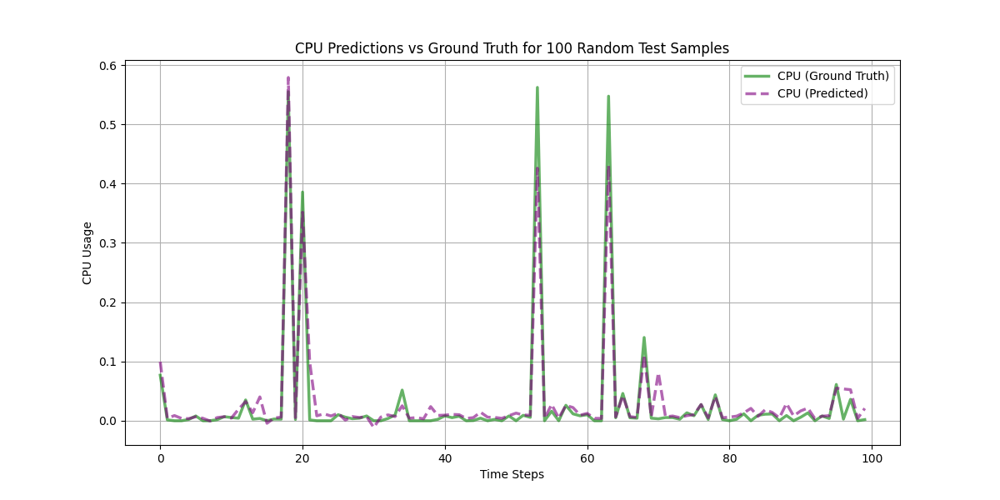
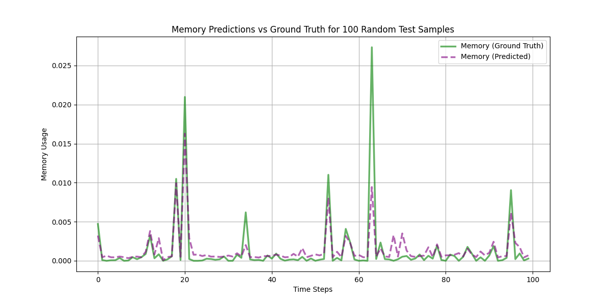
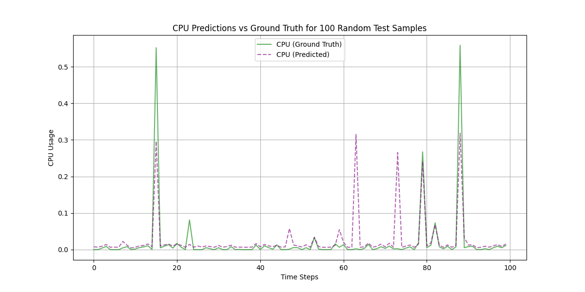
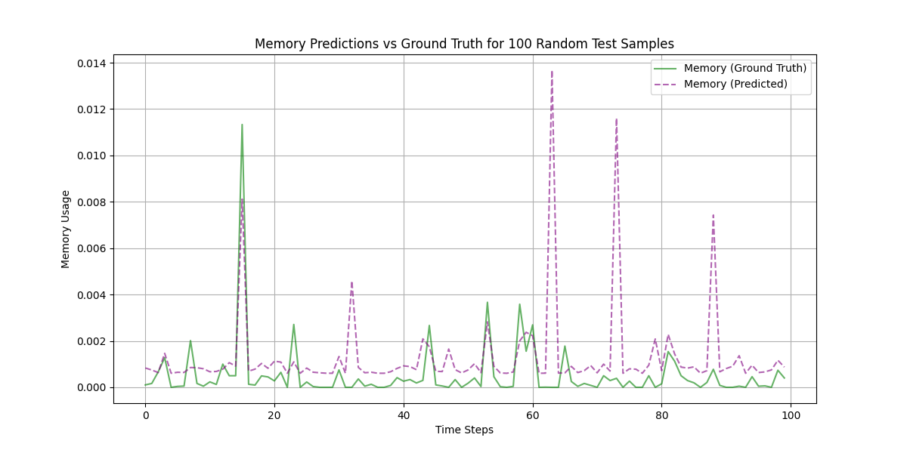

# **Workload Prediction Using LSTM and Feedforward Neural Networks (FFNN)**

This project uses two deep learning models, **Long Short-Term Memory (LSTM)** and **Feedforward Neural Networks (FFNN)**, to predict key workload metrics in a datacenter environment. The predictions focus on four primary performance metrics: **CPU Usage**, **Memory Usage**, **Disk Write Throughput**, and **Network Received Throughput**.

---

## **Dataset**

The dataset used in this project is publicly available and published by Delft University of Technology. It contains historical performance data of 1,750 virtual machines from a distributed datacenter specializing in managed hosting for enterprises. The dataset consists of 10 metrics. For this project, we selected four representative metrics:

1. **CPU Usage [%]**
2. **Memory Usage [KB]**
3. **Disk Write Throughput [KB/s]**
4. **Network Received Throughput [KB/s]**

The data was split into training (80%) and testing (20%) sets. The input sequence length was set to 99, meaning the models used the past 99 time steps to predict the performance metrics for the next 1 time step.

---

## **Models**

### **1. Long Short-Term Memory (LSTM)**

LSTM is a type of recurrent neural network (RNN) that is capable of learning long-term dependencies in sequential data. It maintains a "memory" that helps it to make predictions based on previous time steps. 

- **Architecture**:
  - Two hidden LSTM layers, each with 64 units.
  - An output layer to predict four workload metrics.
  
- **Performance**:
  The LSTM model performed well in predicting memory usage and network throughput but took more time to train due to its sequential nature.

### **2. Feedforward Neural Network (FFNN)**

FFNN is a simpler architecture compared to LSTM. It consists of two fully connected hidden layers and does not have memory capabilities. This makes it faster to train but less effective in capturing temporal dependencies.

- **Architecture**:
  - Two fully connected hidden layers, each with 64 units and ReLU activation.
  - An output layer for predicting four workload metrics.
  
- **Performance**:
  FFNN was faster to train and performed better on CPU usage prediction, though its accuracy in predicting memory and disk write throughput was slightly lower compared to LSTM.

---

## **Results**

We evaluated the models using **Root Mean Squared Error (RMSE)** to compare their performance across the four metrics.

| Metric                 | LSTM RMSE | FFNN RMSE |
|------------------------|-----------|-----------|
| **CPU Usage**           | 0.0392    | 0.0245    |
| **Memory Usage**        | 0.0018    | 0.0021    |
| **Disk Write Throughput**| 0.0024    | 0.0034    |
| **Network Received**    | 0.0004    | 0.0005    |

### **Visualizations**

The following plots show the comparison between the predicted and actual values for both LSTM and FFNN models for two selected metrics: **CPU Usage** and **Memory Usage**.

#### FFNN - CPU Predictions vs Ground Truth


#### FFNN - Memory Predictions vs Ground Truth


#### LSTM - CPU Predictions vs Ground Truth


#### LSTM - Memory Predictions vs Ground Truth


---

## **Installation & Running the Project**

### **1. Clone the Repository**
```bash
git clone https://github.com/Javad-Forough/COGNIT-EU.git
cd COGNIT-EU
```

### **2. Install Required Libraries**
Ensure that you have Python installed along with the necessary libraries. You can install them using the `requirements.txt` file. 
```bash
pip install -r requirements.txt
```

### **3. Prepare Dataset**
Place your dataset file `workload_series.npy` in the project directory.

### **4. Train and Test Models**
To train and evaluate the LSTM or FFNN models, simply run the `main.py` file:
```bash
python main.py
```
Modify the `model_type` variable inside the script to switch between LSTM and FFNN:
```bash
model_type = 'LSTM'  # For LSTM
model_type = 'FFNN'  # For FFNN
```

## **Conclusion**
- **LSTM** is better suited for time-series data and performs well on memory usage and network throughput prediction.
- **FFNN**, while simpler and faster to train, shows competitive performance, especially in CPU usage prediction.

The choice of model depends on the trade-off between accuracy and training complexity. LSTM is generally more powerful for sequential data, while FFNN may suffice for tasks where the sequence is not as important.
